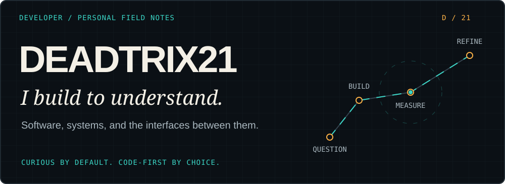
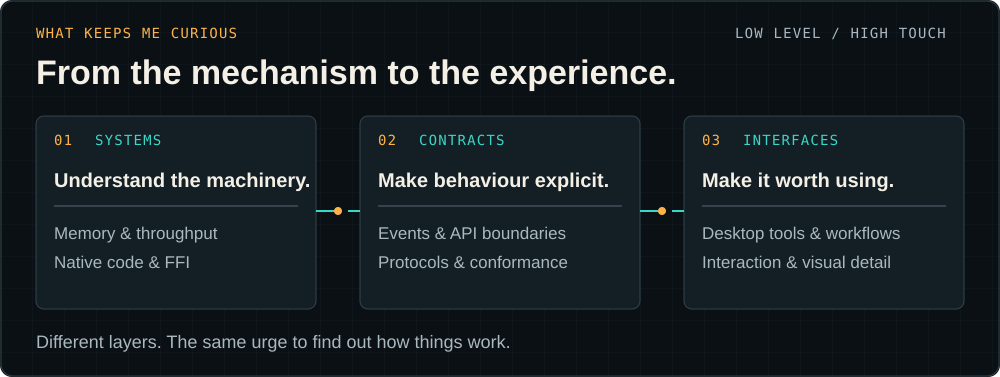
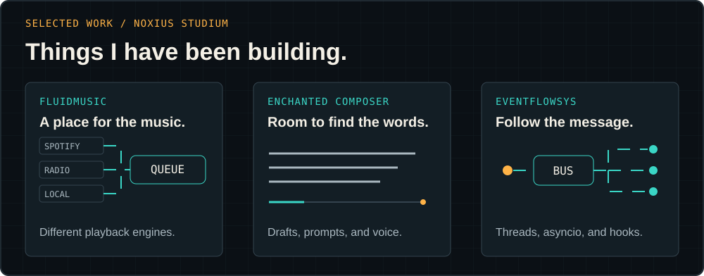
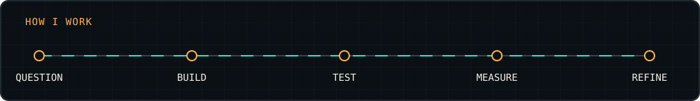

  

  <strong>Software developer. Systems enthusiast. Always learning.</strong> 
  I like understanding what happens underneath—and making the surface feel right.

  <a href="#selected-work">Selected work</a> ·
  <a href="https://github.com/noxius-studium">Noxius Studium</a> ·
  <a href="https://github.com/Deadtrix21?tab=repositories">My repositories</a>

---

## The person behind the code

I'm **Deadtrix21**. I learn by building: take an idea apart, turn it into something executable, and find out which assumptions survive.

My interests sit between **low-level systems, cryptography experiments, and thoughtful interfaces**. I care about memory use, throughput, and small application footprints—but I also care about the details that make a tool pleasant to use. Moving between those layers is part of the fun.

Not everything here is a finished product. Some projects are practical tools; others are experiments or reference implementations. I would rather make that distinction clear than pretend every repository is production-ready.

## What keeps me curious

- **What is the machine actually doing?** Native code, memory behaviour, FFI boundaries, and the cost of moving data.
- **Can I make the behaviour explicit?** Event systems, comparable APIs, shared specifications, and useful diagnostics.
- **Would I enjoy using this?** Desktop utilities, clear controls, and interfaces with attention to detail.

## Selected work

A lot of my recent work lives under **[Noxius Studium](https://github.com/noxius-studium)**. That is where the wider collection of tools and experiments lives.

### [FluidMusic](https://github.com/noxius-studium/fluid-music)

A music workspace for **Hermes Desktop**: Spotify Connect, internet radio, a persistent local library, mixed playlists, and source-aware controls. One listening workflow, without pretending every provider has the same playback engine. Audio visualization is available only where the source exposes samples—not Spotify Connect.

[Architecture](https://github.com/noxius-studium/fluid-music/blob/main/docs/architecture.md) · [Limitations](https://github.com/noxius-studium/fluid-music/blob/main/docs/limitations.md)

### [Enchanted Composer](https://github.com/noxius-studium/enchanted-composer)

Draft enhancement, reusable prompt libraries, multi-step undo/redo, and explicitly started, **owner-bound live voice** for Hermes Desktop. Native send controls stay intact. Ordinary voice transcripts remain temporary; delegated tool work stays with the captured chat.

[Installation](https://github.com/noxius-studium/enchanted-composer/blob/main/docs/installation.md) · [Architecture](https://github.com/noxius-studium/enchanted-composer/blob/main/docs/architecture.md)

### [EventFlowSys](https://github.com/noxius-studium/eventflowsys)

A Python event bus with **threaded and `asyncio` implementations**, grouped subscriptions, priority, TTL, hooks, and metrics. An exploration of making message delivery and its boundaries easier to inspect.

[Examples & tests](https://github.com/noxius-studium/eventflowsys#readme) · [PyPI](https://pypi.org/project/eventflowsys/)

### [ZNRG](https://github.com/Deadtrix21/ZNRG-PUBLIC)

My experimental cryptography and native-library work. The public repository currently contains **binary artifacts, example files, and screenshots**, rather than the implementation source. It is a research project—not a claim of independently audited or production-proven cryptography.

**Also worth exploring:** [REST / GraphQL / SOAP](https://github.com/noxius-studium/soap-json-graphql-example), an educational comparison around a shared user domain. My private workbench also includes South African ID-number conformance and desktop tooling; those are not public downloads.

## Tools I reach for

| Area | Languages and tools |
| :--- | :--- |
| Professional experience | C#, PHP, Python, JavaScript, HTML, CSS |
| Web & desktop interfaces | TypeScript, React, Laravel, Inertia.js, Vite, WPF |
| Native & integration work | C++, native libraries, FFI |
| Data & environment | MySQL, SQL Server, MongoDB, Docker, Linux / WSL |
| Learning & exploring | Go, Java, Kotlin |

Different tools for different problems—not a scoreboard of logos.

## How I work

- **Code first.** A runnable example teaches me more than an untested assumption.
- **Measure the trade-off.** A smaller binary or a faster path matters when the evidence supports it.
- **Keep the seams visible.** Ownership, provider limits, and failure modes belong in the documentation.
- **Leave something useful behind.** A tool, a test, a clear example, or a better explanation.

## Say hello

Have a reproducible bug, a focused improvement, or an interesting technical question? Open an issue or pull request in the relevant public repository.

If my work helps you build something, a visible link back is appreciated. Check each repository's license before reuse—public visibility does not mean identical terms.

---

Keep the curiosity. Test the assumption. Make the next version better.

